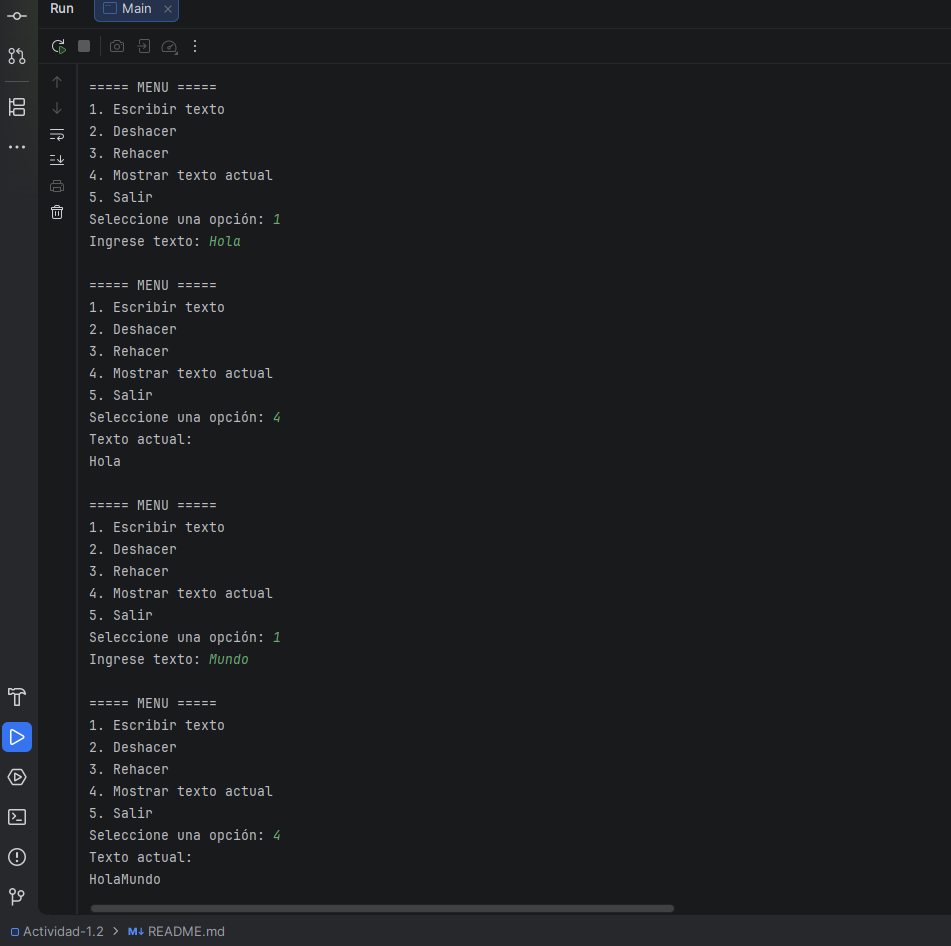
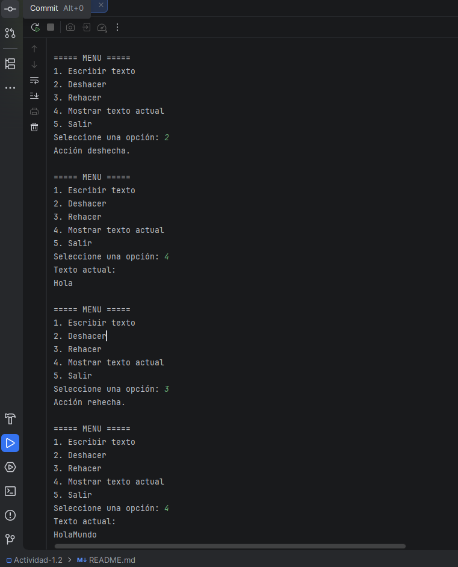

## Actividad 1.2 – Editor de texto con deshacer/rehacer usando pilas

### Objetivo del proyecto

**Objetivo**: Implementar un pequeño editor de texto en consola que permita:
- **Escribir texto** de forma incremental.
- **Deshacer** la última acción realizada.
- **Rehacer** una acción previamente deshecha.

Para lograrlo se utilizan dos estructuras de datos tipo **pila** (`Pila`):
- **Pila de acciones**: guarda los estados anteriores del texto.
- **Pila de deshechas**: guarda los estados que se han deshecho para poder rehacerlos.

Este proyecto sirve para practicar:
- Uso de pilas y su implementación con arreglos.
- Manejo de estados (historial) en un programa interactivo.
- Programación básica en Java con entrada por consola.

### Requisitos previos

- **Java JDK 8+** instalado.
- (Opcional pero recomendado) **IntelliJ IDEA** u otro IDE compatible con proyectos Java.

### Instrucciones de ejecución

#### 1. Ejecutar desde IntelliJ IDEA

1. Abrir IntelliJ IDEA.
2. Seleccionar **File > Open...** y abrir la carpeta `Actividad-1.2`.
3. Asegurarse de que el archivo `Main.java` dentro de `src` esté marcado como clase con método `main`.
4. Hacer clic derecho sobre `Main` y seleccionar **Run 'Main.main()'**.
5. Usar el menú en consola para:
   - `1` Escribir texto.
   - `2` Deshacer.
   - `3` Rehacer.
   - `4` Mostrar texto actual.
   - `5` Salir.

#### 2. Ejecutar desde la terminal (Windows PowerShell o CMD)

1. Abrir una terminal y ubicarse en la carpeta del proyecto:

   ```bash
   cd C:\Users\marlo\IdeaProjects\Actividad-1.2
   ```

2. Compilar los archivos `.java` dentro de `src`:

   ```bash
   javac -d out src\Main.java src\Pila.java
   ```

   (Si la carpeta `out` no existe, se creará automáticamente.)

3. Ejecutar el programa:

   ```bash
   java -cp out Main
   ```

4. Seguir las opciones que aparecen en el menú de la consola.

### Notas

- Si modificas las clases `Main` o `Pila`, vuelve a compilar con `javac` antes de ejecutar otra vez.
- El tamaño máximo de historial está definido por la capacidad de la pila (actualmente `100` elementos).

### Capturas de pantalla


